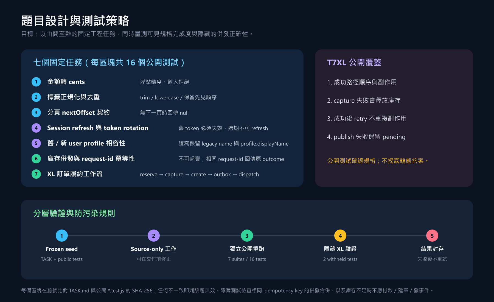
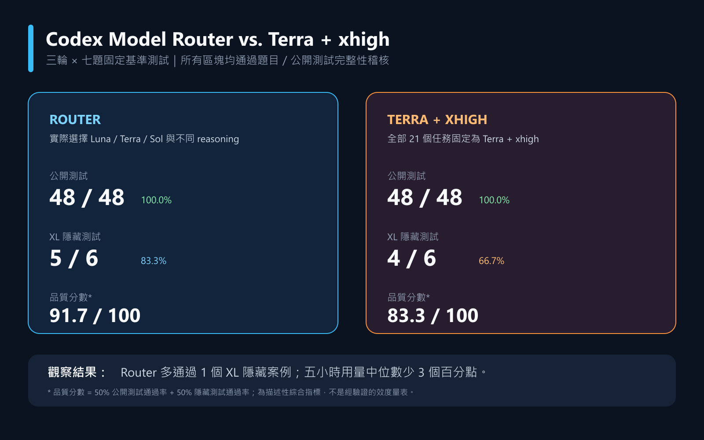
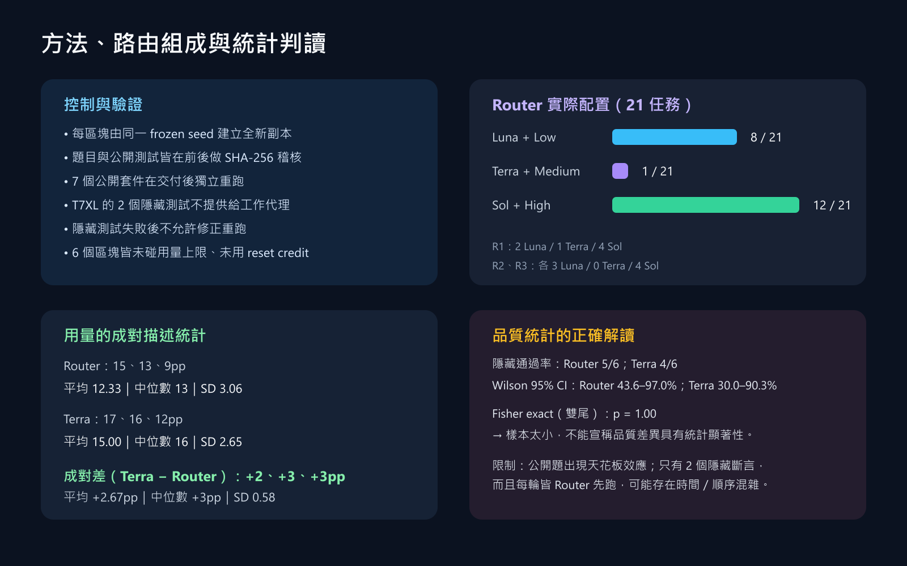
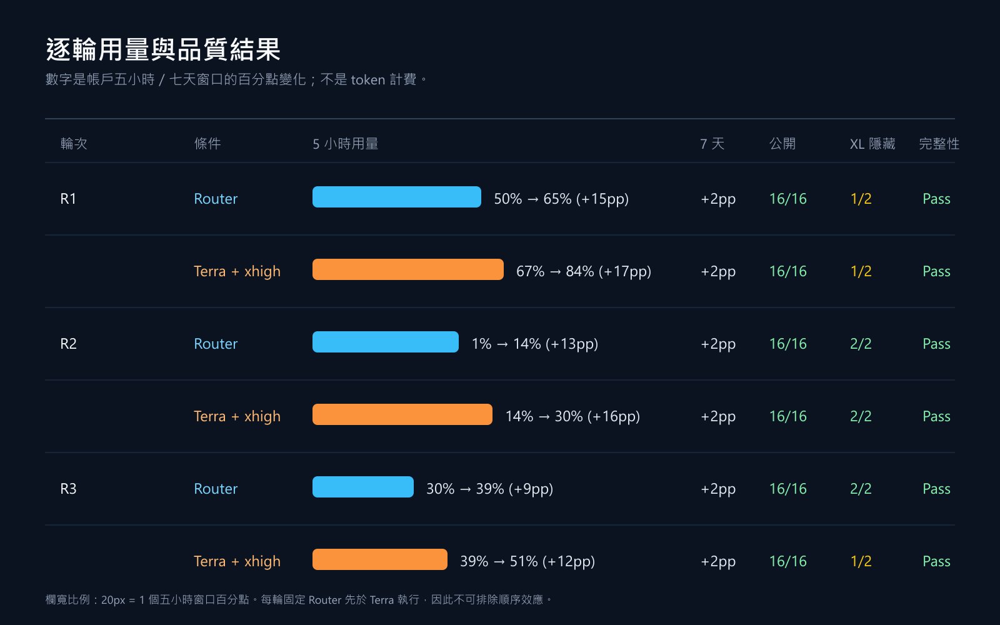

# Codex Model Router

Automatically classifies an explicitly routed technical task, then runs it in one selected Codex subtask with the least costly suitable model and reasoning effort. The parent task receives the subtask's validated handoff and reports the result.

## Install

Run this in PowerShell to install directly into your local Codex skills directory:

```powershell
git clone https://github.com/Funji713/codex-model-router.git "$env:USERPROFILE\.codex\skills\codex-model-router"
```

To update an existing installation:

```powershell
git -C "$env:USERPROFILE\.codex\skills\codex-model-router" pull --ff-only
```

Start a new Codex task after installation if the current task does not discover the skill. Once discovered, the skill is eligible for automatic invocation across conversations whenever a request needs technical execution.

## Use

The skill automatically routes requests that need technical execution. You can also explicitly invoke it with the task that should be routed:

```text
$codex-model-router Investigate the failing checkout integration, implement the smallest verified fix, and run the focused tests.
```

The parent task scores scope, reasoning, ambiguity, dependencies, risk, and context need. It chooses the lowest suitable available model: `gpt-6-luna` for mechanical work, `gpt-6.1-sol` for normal engineering, and `gpt-6-astra` only for exceptional, evidence-supported frontier work. `gpt-6-sol` and 5.x models are compatibility fallbacks, not automatic first choices. The execution subtask owns implementation and validation, then returns changed paths, test results, and any remaining limitations to the parent.

If the current host cannot create a selected subtask, the skill stops rather than silently executing with an unselected model.

See [SKILL.md](SKILL.md) for the routing contract and [routing-policy.md](references/routing-policy.md) for the scoring and escalation policy.

## Benchmark snapshot

The following small, descriptive benchmark compares the router with a fixed `Terra+XHigh` baseline. It is included to make the observed effect of routing inspectable, not to claim universal quality or cost gains.

### Visual summary









### Results and method

- **Design:** 3 rounds × 7 fixed tasks = 21 tasks. The router always ran first, so order and time confounding remain possible.
- **Public tests:** Router 48/48; fixed `Terra+XHigh` baseline 48/48. This is a ceiling effect, not evidence that the systems are universally equivalent.
- **Hidden tests:** Router 5/6; baseline 4/6. Only two hidden assertions were available, so this is a very small signal.
- **Descriptive composite:** Router 91.7 vs baseline 83.3.
- **Router route composition:** `Luna+Low` 8/21, `Terra+Medium` 1/21, `Sol+High` 12/21.
- **Five-hour account-window usage delta:** Router average 12.33 percentage points, median 13pp; baseline average 15.00pp, median 16pp; median reduction 3pp.

Account-window percentage-point deltas are not token counts. The measurements are small-sample/descriptive only; no statistical significance claim is made (Fisher two-sided p=1.00 from the available evidence). Withheld test answers are intentionally not disclosed.
